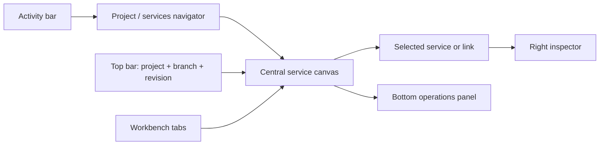

# Config workspace

## 1. Shell

Config workspace — основной canvas-first экран Studio. Он показывает структуру
проектной конфигурации, а не live-подключение к Core.

Зоны:

- activity bar — переключение разделов;
- top bar — project, branch, commit/revision, validation summary, deploy report;
- navigator — files и services;
- canvas — nodes и links;
- inspector — выбранный node/link;
- bottom panel — operations, problems, events;
- workbench tabs — Config workspace и Studio plugin pages.

По умолчанию виден canvas. Navigator и bottom panel скрываемы. Inspector
открывается при выборе объекта.

## 2. Страницы

### Start / Projects

Показывает открытые projects, repository status и последние CLI/CI reports.

### Project workspace

Показывает file tree, project metadata, validation и drafts.

### Config workspace

Показывает canvas проектных services, Core-owned links и schema-driven inspector.

### Services

Показывает inventory services в таблице с фильтрами и переходом в canvas.

### Deploy reports

Показывает импортированные CLI/CI reports, operations, ACKs, errors и degraded
states. Live Core access из Studio отсутствует.

### Marketplace

Показывает только Studio plugins: Discover, Installed, Updates и Details.

### Settings

Показывает Studio connections, project preferences, layout и plugin permissions.

## 3. Canvas

На canvas отображаются:

- project service nodes;
- Core-owned service link declarations;
- schema/validation badges;
- last known deploy report indicators;
- project binding markers;
- selection и focus.

Сам Core, Core database, live replicas, credentials и plugin internals на canvas
не рисуются.

### Service node

Минимум:

- display name;
- stable service id;
- type/manifest version;
- local validation state;
- last known deploy state;
- problem badge;
- project binding.

Click выбирает node и открывает inspector. Double-click переводит фокус в
settings section inspector.

### Link

Link создаётся drag-жестом между двумя service nodes. Inspector показывает:

- caller;
- target;
- link id;
- declared policy generation;
- validation state;
- generic contract/transport metadata, если оно доступно Core.

Product-specific routing и payload editor в общий Studio inspector не входят.

### Layout

Положение node — локальное представление Studio, а не автоматически Core-owned
configuration. Доступны move, multi-select, zoom/pan, fit to content, focus from
tree/search и reset local layout.

## 4. Service inspector

Секции inspector:

1. identity — name, id, manifest version;
2. settings — schema-generated fields;
3. source binding — project file/module references;
4. last deploy — commit, bundle digest, report state;
5. links — входящие и исходящие связи;
6. context — безопасные timestamps и actor metadata.

Поддерживаемые UX-типы полей: string, number, boolean, select, multiselect,
duration, size, code/reference, file, directory, array/object и secret
reference без возврата secret value.

Неизвестный тип поля делает surface недоступным с diagnostic, а не превращается
в произвольный HTML control.

## 5. Link inspector

Показывает generic данные:

- caller и target;
- link id;
- policy generation source;
- eligibility and validation;
- contract compatibility;
- transport/profile declaration;
- last deploy report.

Общий inspector не знает product-specific методы и payloads.

## 6. Services workspace

Таблица services должна показывать:

- service id/name;
- manifest/schema version;
- local validation;
- last known deploy generation;
- last report state;
- local project binding.

Таблица и canvas используют один project config read model и не создают второй
источник истины. Runtime observations принадлежат Core и доступны только в CLI
reports.
