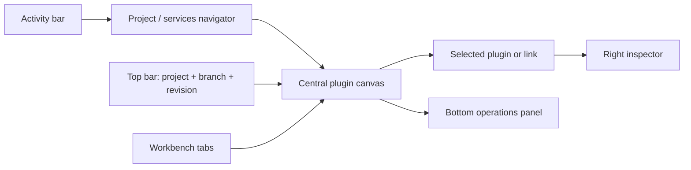

# Config workspace

## 1. Shell

Config workspace — основной canvas-first экран Studio. Он показывает runtime
plugins и связи между ними, а не live-подключение к Core.

Зоны:

- activity bar — переключение разделов;
- top bar — project, branch, commit/revision, validation summary, deploy report;
- navigator — files и runtime plugins;
- canvas — plugin nodes и links;
- inspector — выбранный node/link;
- bottom panel — operations, problems, events;
- workbench tabs — Config workspace и Studio plugin pages.

По умолчанию виден canvas. Navigator и bottom panel скрываемы. Inspector
открывается при выборе объекта.

## 2. Страницы

### Start / Projects

Показывает открытые projects, repository status и последние CLI/CI reports.

### Project workspace

Показывает file tree, project metadata, validation и drafts.

### Config workspace

Показывает canvas runtime plugin instances, plugin-to-plugin links и
schema-driven inspector.

### Services

Показывает inventory runtime plugins в таблице с фильтрами и переходом в canvas.

### Deploy reports

Показывает импортированные CLI/CI reports, operations, ACKs, errors и degraded
states. Live Core access из Studio отсутствует.

### Installed Studio plugins

Показывает только локально импортированные Studio plugins, trust decisions,
installed tools, updates из нового local package и rollback.

### Settings

Показывает project preferences, layout и plugin permissions. Параметры Core и
доступ к runtime изменяются через standalone CLI, а не через Studio.

## 3. Canvas

На canvas отображаются только:

- runtime plugin instances из Project;
- полные versioned plugin-to-plugin link contracts;
- schema/validation badges;
- last known deploy report indicators;
- project binding markers;
- selection и focus.

Сам Core, Core database, live replicas, credentials и plugin internals на canvas
не рисуются.

### Runtime plugin node

Минимум:

- display name;
- stable plugin/service id;
- type/manifest version;
- local validation state;
- last known deploy state;
- problem badge;
- project binding.

Click выбирает node и открывает inspector. Double-click переводит фокус в
settings section inspector.

### Link

Link создаётся drag-жестом между двумя runtime plugin nodes. Inspector редактирует
полный versioned contract и показывает:

- caller;
- target;
- link id;
- methods и enabled/disabled methods;
- request/response schemas;
- transport и security profile;
- timeout/retry/limits и redaction policy;
- validation state;
- generic contract/transport metadata, если оно доступно Core.

Product-specific UI не встраивается в общий renderer: plugin-owned schemas
рендерятся generic host-controlled controls.

### Layout

Положение node — локальное представление Studio, а не автоматически Core-owned
configuration. Доступны move, multi-select, zoom/pan, fit to content, focus from
tree/search и reset local layout.

## 4. Runtime plugin inspector

Секции inspector:

1. identity — name, id, plugin и manifest version;
2. settings — schema-generated fields;
3. source binding — project file/module references;
4. last deploy — commit, bundle digest, report state;
5. links — входящие и исходящие связи;
6. context — безопасные timestamps и actor metadata.

Поддерживаемые UX-типы полей: string, number, boolean, select, multiselect,
duration, size, code/reference, file, directory, array/object и secret
reference без возврата secret value.

Неизвестный тип поля делает surface недоступным с diagnostic, а не превращается
в произвольный HTML control. Перед записью host повторно проверяет
тип/required/enum/bounds/pattern constraints и вложенные значения; renderer не
является security boundary сам по себе.

## 5. Link inspector

Показывает generic данные:

- caller и target;
- link id;
- contract/schema version;
- eligibility and validation;
- contract compatibility;
- methods, request/response schemas, transport/profile, security, limits;
- redaction policy;
- last deploy report.

Общий inspector не знает product-specific методы и payloads.

## 6. Runtime plugins workspace

Таблица runtime plugins должна показывать:

- service id/name;
- manifest/schema version;
- local validation;
- last known deploy generation;
- last report state;
- local project binding.

Таблица и canvas используют один project config read model и не создают второй
источник истины. Runtime observations принадлежат Core и доступны только в CLI
reports.
