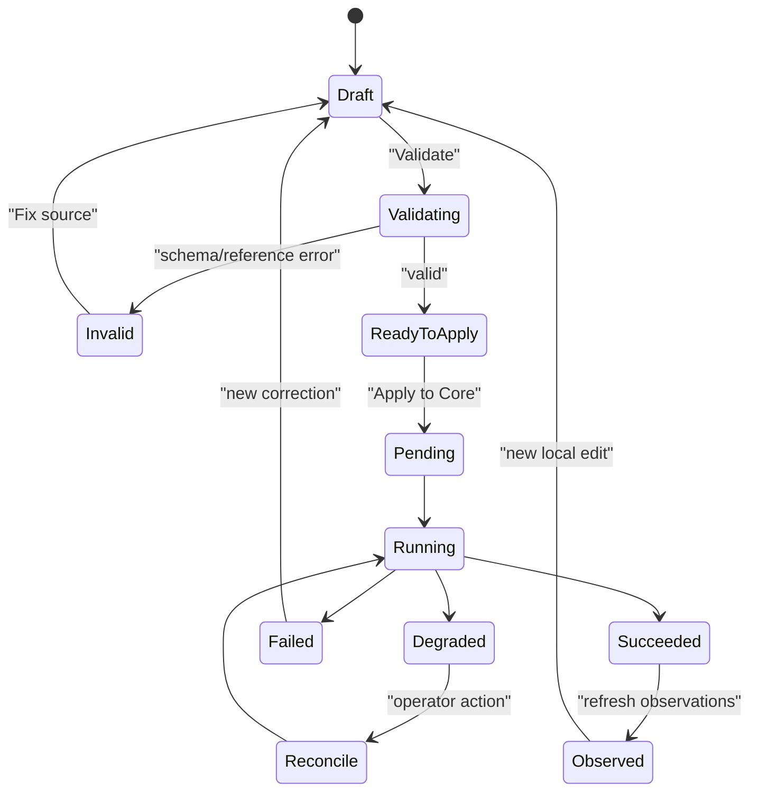

# Operations и диагностика

## 1. Смысл operations

Любое действие, которое может изменить Core desired state или вызвать внешний
effect, должно иметь наблюдаемый operation lifecycle.

Studio не объявляет operation успешной по факту принятия HTTP-запроса. Она
показывает только состояние, которое вернул Core.

## 2. Состояния



Core terminal states `succeeded`, `failed` и `degraded` не должны называться
одинаково в UI. Особенно важно не превращать `degraded` в «почти success».

## 3. Operations workspace

Фильтры:

- project;
- Core connection;
- service;
- operation kind;
- state;
- time range.

Запись содержит только безопасные metadata:

- operation id;
- kind;
- service/resource id;
- generation/digest, если разрешено контрактом;
- timestamps;
- state;
- error code;
- target replicas и ACK state.

Raw request/response, credentials, secret references и private keys не выводятся.

## 4. Bottom panel

Bottom panel открывается для:

- pending/running operations;
- validation problems;
- degraded rollout;
- failed operation;
- stale observation;
- plugin disconnect.

В спокойном состоянии панель скрыта, но краткий summary operation остаётся в
top bar.

## 5. Diagnostic model

Диагностика отвечает на вопросы:

1. что хотел изменить оператор;
2. какая generation стала active;
3. какие replicas подтвердили target;
4. что можно сделать дальше.

Для degraded state показываются evidence и remediation hint. Не показывается
фиктивная кнопка `Restart service`, если Core не владеет process lifecycle.

## 6. Problems

Категории:

- project validation;
- schema validation;
- connection/authentication;
- conflict/CAS;
- Core operation;
- replica/lease/readiness;
- Studio plugin compatibility;
- file access/permissions.

У каждой проблемы есть severity, owner, location и suggested next step.

## 7. Apply flow

```mermaid
flowchart LR
    A["Local draft"] --> B["Validate"]
    B -->|"invalid"| C["Problems panel"]
    C --> A
    B -->|"valid"| D["Show diff"]
    D --> E["Confirm Apply"]
    E --> F["Core operation"]
    F --> G["Generation + replica ACK"]
    G --> H{ "State" }
    H -->|"succeeded"| I["Observed ready"]
    H -->|"failed"| C
    H -->|"degraded"| J["Evidence + reconcile guidance"]
```

## 8. Audit/context

Оператору нужно показывать безопасный context:

- actor;
- request/correlation id;
- resource/service;
- operation id;
- timestamps;
- result/error code.

Audit не должен раскрывать body settings, credentials и secret values.
