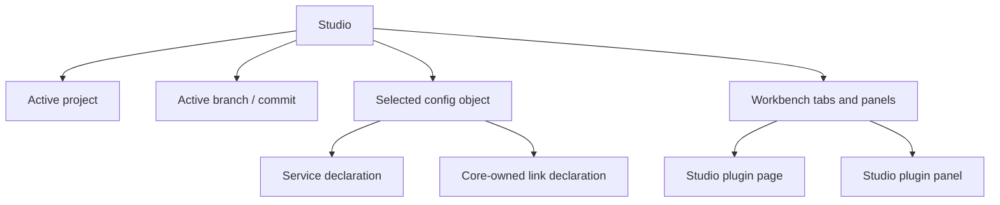

# Продуктовая модель Studio

## 1. Роль Studio

Studio находится между IDE и configuration workbench:

- как Android Studio — имеет project, manifest, file tree и редакторы;
- как Unity — показывает объектную сцену сервисов и inspector выбранного объекта;
- как Figma — использует canvas-first рабочее пространство и dockable panels.

Core не рисуется отдельным узлом. Studio не является control-plane client и не
подключается к Core. Canvas показывает service declarations из project source и
Core-owned links, а результат deploy приходит только через CLI report.

## 2. Термины

### Core

Единичный runtime control plane, который хранит применённую desired
configuration в SQLite, публикует immutable generations и наблюдает replicas,
leases, readiness и rollout. Core доступен CLI, но не Studio.

### Core service declaration

Проектная декларация сервиса, который будет собран CLI в bundle для Core. В
Studio она представлена canvas node, строкой в дереве сервисов и правым
schema-driven inspector. Runtime observations отображаются только из
импортированного CLI/CI report.

Core service не добавляет в Studio произвольную страницу, HTML, CSS или
JavaScript. Product-specific fields приходят через declarative settings schema.

### Studio plugin

Расширение самой Studio. Оно отделено от Core services и может объявлять
commands, workbench pages, dockable panels, file editors и capability access.

### Project

Локальная source-структура Studio с root-папкой, manifest и деревом файлов.
Project не является копией Core SQLite и не заменяет Core как runtime source of
truth.

### Git revision

Immutable commit, из которого CLI может собрать deployable bundle. Незакоммиченный
working tree не может быть передан в `apply`.

## 3. Четыре независимых контекста

Правила разделения:

- смена project или branch не теряет drafts и незакоммиченные Git changes;
- изменение файла не считается deployable без commit;
- CLI report не переписывает source files;
- Studio plugin не получает Core credentials;
- удаление локального файла не удаляет Core generation.

## 4. Три состояния конфигурации

| Состояние | Владелец | Что означает |
| --- | --- | --- |
| Local source | Project files | Что оператор редактирует |
| Commit-backed bundle | CLI run | Что будет передано выбранному target |
| Applied/observed state | Core SQLite и CLI report | Что Core принял и что replicas подтвердили |

Studio должна визуально различать эти состояния. Нельзя показывать local draft
как applied generation.

## 5. Общий lifecycle изменения

Проект можно открыть и валидировать без Core. Для deploy нужны:

- выбранный CLI target;
- валидный manifest;
- валидные schemas и references;
- решённые Git-конфликты;
- immutable commit;
- remote approval, если target policy этого требует.

## 6. Ownership

| Объект | Владелец | Studio делает |
| --- | --- | --- |
| Core desired configuration | Core SQLite + CLI | Показывает provenance из CLI report |
| Replica/lease observations | Core/SDK + CLI report | Импортирует и фильтрует report |
| Project files | Project workspace | Индексирует, валидирует, редактирует через подходящий surface |
| Core service settings schema | Core service contract | Строит inspector |
| Studio plugin extension manifest | Studio plugin ecosystem | Регистрирует commands/pages/panels |
| Plugin marketplace package | Marketplace/deployment owner | Показывает metadata и lifecycle |

## 7. Что не входит в базовую Studio

- Core API adapter и process supervisor для Core services;
- Docker/Swarm/Kubernetes control;
- Core credentials в frontend;
- product-specific routing editor общего назначения;
- автоматический replay неизвестной операции;
- raw JSON как основной операторский workflow;
- произвольные plugin web pages внутри Core inspector.
