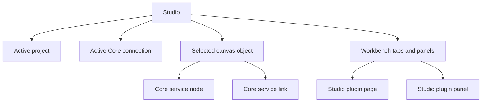

# Продуктовая модель Studio

## 1. Роль Studio

Studio находится между IDE и control-plane client:

- как Android Studio — имеет project, manifest, file tree и редакторы;
- как Unity — показывает объектную сцену сервисов и inspector выбранного объекта;
- как Figma — использует canvas-first рабочее пространство и dockable panels.

Core не рисуется отдельным узлом. Studio — оболочка вокруг Core, а canvas
показывает подключённые Core services и связи между ними.

## 2. Термины

### Core

Единичный control plane, который хранит desired configuration, публикует
immutable generations и наблюдает replicas, leases, readiness и rollout.

### Core service

Подключённый к Core сервис. В Studio он представлен canvas node, строкой в
дереве сервисов, observed state и правым schema-driven inspector.

Core service не добавляет в Studio произвольную страницу, HTML, CSS или
JavaScript. Product-specific fields приходят через declarative settings schema.

### Studio plugin

Расширение самой Studio. Оно отделено от Core services и может объявлять
commands, workbench pages, dockable panels, file editors и capability access.

### Project

Локальная source-структура Studio с root-папкой, manifest и деревом файлов.
Project не является копией Core SQLite и не заменяет Core как runtime source of
truth.

### Core connection

Отдельное подключение к Core. На desktop Studio может хранить несколько
подключений и выбирать активное в глобальном shell.

## 3. Четыре независимых контекста

Правила разделения:

- смена project не меняет Core connection молча;
- изменение файла не считается применённым в Core;
- observed state не переписывает source files без явного sync action;
- остановка Studio plugin не останавливает Core service;
- удаление локального файла не удаляет Core generation.

## 4. Три состояния конфигурации

| Состояние | Владелец | Что означает |
| --- | --- | --- |
| Local source | Project files | Что оператор подготовил к применению |
| Active desired state | Core SQLite | Что Core хочет раскатить |
| Observed state | Core observations | Что replicas фактически подтвердили |

Studio должна визуально различать эти состояния. Нельзя показывать local draft
как active generation.

## 5. Общий lifecycle изменения

Проект можно открыть и валидировать без Core. Для Apply нужны:

- выбранный target connection;
- валидный manifest;
- валидные schemas и references;
- решённые конфликты revision/CAS;
- явное подтверждение пользователя.

## 6. Ownership

| Объект | Владелец | Studio делает |
| --- | --- | --- |
| Core desired configuration | Core | Читает, изменяет через Management API, показывает diff |
| Replica/lease observations | Core/SDK | Отображает и фильтрует |
| Project files | Project workspace | Индексирует, валидирует, редактирует через подходящий surface |
| Core service settings schema | Core service contract | Строит inspector |
| Studio plugin extension manifest | Studio plugin ecosystem | Регистрирует commands/pages/panels |
| Plugin marketplace package | Marketplace/deployment owner | Показывает metadata и lifecycle |

## 7. Что не входит в базовую Studio

- process supervisor для Core services;
- Docker/Swarm/Kubernetes control;
- Core credentials в frontend;
- product-specific routing editor общего назначения;
- автоматический replay неизвестной операции;
- raw JSON как основной операторский workflow;
- произвольные plugin web pages внутри Core inspector.
