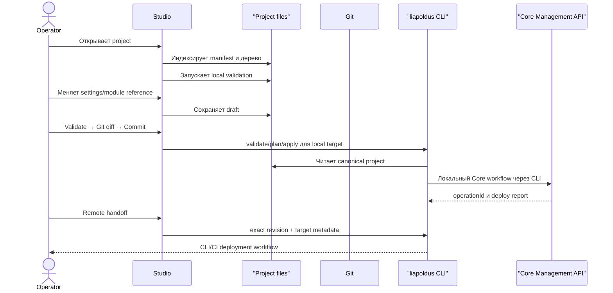

# Project и дерево файлов

## 1. Project как source workspace

Project — это локальная root-папка с manifest и индексируемым деревом файлов.
Он работает без доступного Core. Deploy не выполняется из Studio: commit
передаётся универсальному `liapoldus` CLI для выбранного target.

Project не хранит копию Core SQLite, Core credentials или secret values. Он
содержит source references, modules, schemas и локальные metadata, необходимые
для сборки config bundle универсальным `liapoldus` CLI.

## 2. Целевая структура

Эта структура является каноническим Project-контрактом CLI. Studio не вводит
второй формат и не превращает `.studio/` в источник runtime-конфигурации:

```text
liapoldus-project/
├── project.yaml                 # identity, format version, target profiles
├── services/
│   ├── runtime-service/
│   │   ├── service.yaml         # identity, plugin version, schema references
│   │   ├── settings.json        # schema-driven plugin settings
│   │   └── links/               # полные versioned plugin-to-plugin contracts
│   │       └── forms-db.json
│   ├── forms-db-service/
│   │   └── service.yaml
│   └── server-service/
│       └── service.yaml
├── modules/
│   ├── auth-flow/
│   │   ├── module.yaml
│   │   └── source/
│   └── form-validation/
│       ├── module.yaml
│       └── source/
├── schemas/
│   ├── service-bindings/
│   └── modules/
├── environments/
│   ├── local.yaml                # target/profile metadata, без credentials
│   └── production.yaml
└── .studio/
    ├── workspace.json           # canvas/layout, tabs и filters
    ├── index/                   # generated local index
    ├── reports/                 # imported redacted reports
    ├── diagnostics.jsonl        # redacted recoverable CLI/plugin diagnostics
    └── drafts/                  # local drafts без secrets

`project.yaml`, `service.yaml`, `settings.json` и `links/*.json` редактируются
как source. `.studio/` является локальным desktop state, исключается из CLI
bundle и не содержит Core credentials. Git repository является частью Project:
Studio явно показывает branch, revision и dirty state, но не подменяет Git
источник истории своей SQLite-базой.
```

## 3. Узлы дерева

Дерево должно отличать:

- project metadata;
- runtime plugin services;
- modules;
- schemas;
- environment profiles;
- generated/local metadata;
- validation problems;
- changed и untracked files.

Для файла показываются:

- имя и тип;
- относительный путь;
- dirty state;
- validation state;
- связанный service/module;
- plugin, который умеет его открыть;
- последний применённый digest, если он известен.

## 4. Project navigator

Project navigator — dockable panel слева. Он поддерживает:

- collapse/expand folders;
- поиск по имени и содержимому metadata;
- фильтр `services`, `modules`, `schemas`, `changed`, `problems`;
- создание project-owned file через зарегистрированный file type;
- `Open`, `Reveal`, `Rename`, `Delete` с подтверждением;
- `Open in plugin`, если тип файла принадлежит Studio plugin.

В desktop shell доступны bounded search и фильтры `services`, `modules`,
`schemas`, `changed`. Их значения и текущая selection сохраняются в
`.studio/workspace.json`; это локальное UI-состояние и не меняет canonical
Project format.

Project service tree и project file tree могут быть двумя вкладками одной панели:

```text
PROJECT
  services/
  modules/
  schemas/

PROJECT SERVICES
  runtime-service        Ready · gen 42
  forms-db-service       Degraded · gen 41
  server-service         Ready · gen 42
```

## 5. File tree и canvas

У них разные задачи:

- file tree отвечает «где находится source»;
- canvas отвечает «как services связаны»;
- inspector отвечает «что настроено у выбранного объекта»;
- operations отвечает «что произошло после CLI deploy».

Выбор service в дереве центрирует node на canvas и открывает inspector. Выбор
файла открывает preview/structured editor и показывает связанные services.

## 6. Local source → CLI → Core



Studio не подключается к Core API, не хранит target credentials и не выполняет
remote deployment. Для `local` Studio запускает `liapoldus` как дочерний процесс
и импортирует его JSONL events/reports. Для remote Studio только подготавливает
exact CLI handoff и открывает provenance результата.

## 7. Inspector и files

Поле `file reference` выбирает файл из project tree или показывает opaque
reference. Оно не раскрывает secrets и не превращает файл в runtime config
автоматически.

Пример:

```text
Runtime plugin: runtime-service
Field: Logic module
Value: modules/auth-flow
Action: Open in Logic Modules
```

Base Studio не обязана быть полноценной code IDE. Редактор module/source должен
принадлежать специализированному Studio plugin.

Для любого файла доступны системный default application, выбор приложения и
per-file/per-type association. Studio передаёт native path через OS launcher,
не строит shell-команду из пользовательской строки и не передаёт редактору
secrets. Встроенного Monaco/CodeMirror/code editor в продукте нет.

## 8. Draft, validation и deploy handoff

Inspector различает четыре действия:

- `Save draft` — сохранить локальное изменение;
- `Validate` — проверить schema и references;
- `Diff` — показать отличие от выбранной Git revision;
- `Commit` — создать immutable revision;
- `Open deploy report` — открыть результат CLI/CI.

`Commit` disabled при:

- невалидном manifest;
- неизвестном field type;
- отсутствующем обязательном module/file;
- конфликте файлов;
- невалидном project source;
- незаполненном commit message.

Studio не имеет кнопки `Apply to Core`. Deploy запускается универсальным CLI:

```bash
liapoldus apply --project ./project --revision <commit> --target production
```

CLI обязан получить exact commit, собрать bundle и передать его Core API. Studio
может открыть сохранённый report, но не является его источником.

## 9. Project и target report switching

В верхней панели явно показываются контексты проекта и последнего deploy report:

```text
Project: forms-platform       Revision: 0123456       Target report: production
```

При смене project, branch или report Studio предупреждает о:

- dirty files;
- inspector drafts;
- незавершённых Git operations;
- недоступных plugin editors;
- несоответствии target profile.

## 10. Offline и deploy handoff

Всегда доступны без Core:

- открытие file tree;
- preview source;
- local validation;
- draft;
- plugin pages, не требующие Core;
- commit, push/pull и другие Git operations.

Deploy state без CLI report не считается применённым. Studio не должна выдавать
локальный source за active Core generation.
