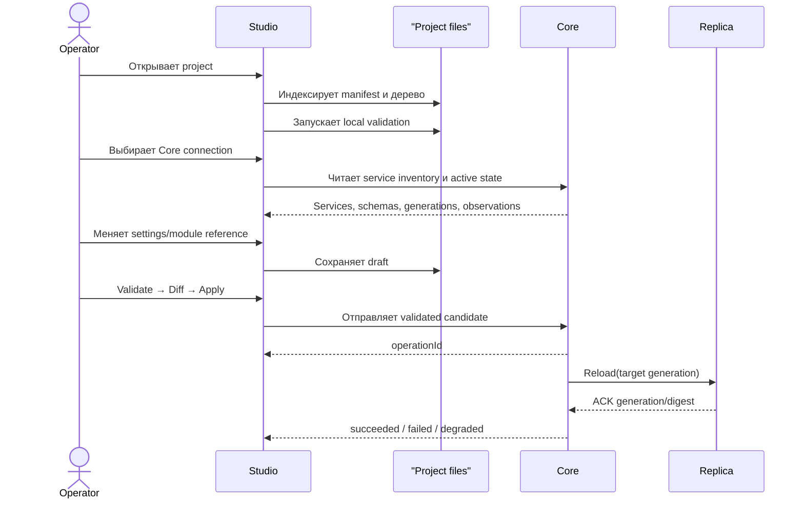

# Project и дерево файлов

## 1. Project как source workspace

Project — это локальная root-папка с manifest и индексируемым деревом файлов.
Он может быть открыт без доступного Core, но Apply требует явного Core
connection.

Project не хранит копию Core SQLite, credentials или secret values. Он содержит
source references, modules, schemas и локальные metadata, необходимые для
подготовки desired configuration.

## 2. Целевая структура

Имена и форматы ниже являются UX-моделью, а не утверждённым публичным
wire-контрактом:

```text
liapoldus-project/
├── project.yaml                 # identity, format version, target profiles
├── services/
│   ├── runtime-service/
│   │   ├── service.yaml         # service binding и settings references
│   │   ├── settings/            # source settings, если разрешено schema
│   │   └── links/               # проектные декларации связей
│   ├── forms-db-service/
│   │   └── service.yaml
│   └── server-service/
│       └── service.yaml
├── modules/
│   ├── auth-flow/
│   │   ├── module.yaml
│   │   └── source/
│   └── form-validation/
│       ├── module.yaml
│       └── source/
├── schemas/
│   ├── service-bindings/
│   └── modules/
├── environments/
│   ├── local.yaml
│   └── production.yaml
└── .studio/
    ├── index/                   # generated local index, не VCS source
    └── drafts/                  # локальные drafts без secrets
```

## 3. Узлы дерева

Дерево должно отличать:

- project metadata;
- Core services;
- modules;
- schemas;
- environment profiles;
- generated/local metadata;
- validation problems;
- changed и untracked files.

Для файла показываются:

- имя и тип;
- относительный путь;
- dirty state;
- validation state;
- связанный service/module;
- plugin, который умеет его открыть;
- последний применённый digest, если он известен.

## 4. Project navigator

Project navigator — dockable panel слева. Он поддерживает:

- collapse/expand folders;
- поиск по имени и содержимому metadata;
- фильтр `services`, `modules`, `schemas`, `changed`, `problems`;
- создание project-owned file через зарегистрированный file type;
- `Open`, `Reveal`, `Rename`, `Delete` с подтверждением;
- `Open in plugin`, если тип файла принадлежит Studio plugin.

Core service tree и project file tree могут быть двумя вкладками одной панели:

```text
PROJECT
  services/
  modules/
  schemas/

CORE SERVICES
  runtime-service        Ready · gen 42
  forms-db-service       Degraded · gen 41
  server-service         Ready · gen 42
```

## 5. File tree и canvas

У них разные задачи:

- file tree отвечает «где находится source»;
- canvas отвечает «как services связаны»;
- inspector отвечает «что настроено у выбранного объекта»;
- operations отвечает «что произошло после Apply».

Выбор service в дереве центрирует node на canvas и открывает inspector. Выбор
файла открывает preview/structured editor и показывает связанные services.

## 6. Local source → Core



## 7. Inspector и files

Поле `file reference` выбирает файл из project tree или показывает opaque
reference. Оно не раскрывает secrets и не превращает файл в runtime config
автоматически.

Пример:

```text
Core service: runtime-service
Field: Logic module
Value: modules/auth-flow
Action: Open in Logic Modules
```

Base Studio не обязана быть полноценной code IDE. Редактор module/source должен
принадлежать специализированному Studio plugin.

## 8. Draft, validation и Apply

Inspector различает четыре действия:

- `Save draft` — сохранить локальное изменение;
- `Validate` — проверить schema и references;
- `Diff` — показать отличие от Core desired/active state;
- `Apply to Core` — создать durable Core operation.

`Apply to Core` disabled при:

- невалидном manifest;
- неизвестном field type;
- отсутствующем обязательном module/file;
- невыбранном Core connection;
- stale revision/CAS;
- неподтверждённом permission.

## 9. Project и connection switching

В верхней панели явно показываются оба контекста:

```text
Project: forms-platform       Core: production-eu       Target: production
```

При смене project или connection Studio предупреждает о:

- dirty files;
- inspector drafts;
- незавершённых operations;
- недоступных plugin editors;
- несоответствии target profile.

## 10. Offline

Без Core разрешены:

- открытие file tree;
- preview source;
- local validation;
- draft;
- plugin pages, не требующие Core.

Без Core запрещены:

- объявление settings применёнными;
- новый Core operation;
- свежий readiness state;
- утверждение, что local source совпадает с active generation.
