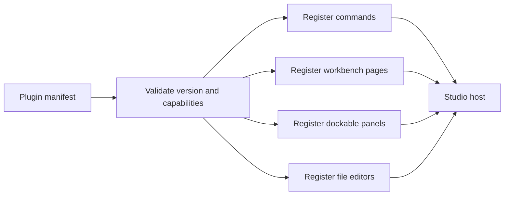
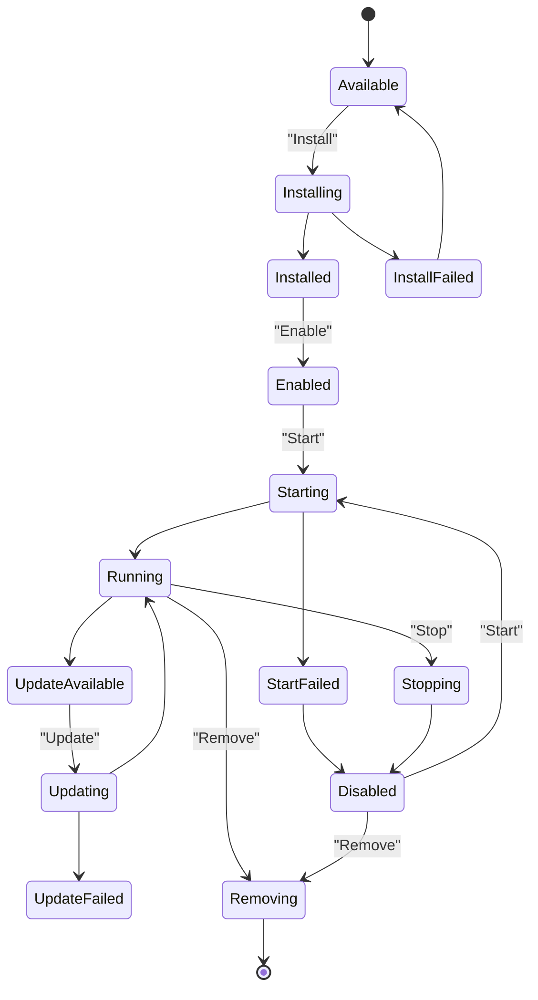
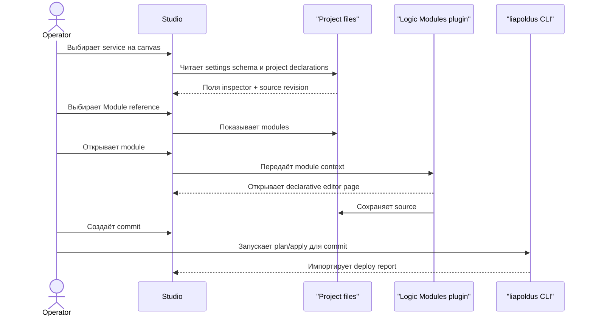

# Studio plugins и marketplace

## 1. Две разные модели

| | Core services | Studio plugins |
| --- | --- | --- |
| Назначение | Runtime/control-plane services | Расширения Studio |
| Представление | Canvas node + inspector | Commands, pages, panels |
| Lifecycle | Core наблюдает и применяет settings | Marketplace install/start/update |
| Settings UI | Schema-driven inspector | Собственные declarative surfaces |
| Process control | Не управляется Studio | Отдельный plugin lifecycle |
| Ошибка | Degraded service/replica | Plugin unavailable/disconnected |

Нельзя показывать Core service как Studio plugin marketplace item.

## 2. Extension manifest

Studio plugin должен объявлять:

- identity;
- version;
- required Studio range;
- commands;
- pages;
- panels;
- file types/editors;
- capability requirements;
- permissions explanation;
- lifecycle metadata.

Точный wire schema должен быть утверждён отдельным владельцем. В Studio этот
manifest используется для безопасной регистрации extension points.

## 3. Extension host

Studio рендерит объявленные surfaces собственными компонентами. Произвольный
HTML/CSS/remote JavaScript не должен автоматически попадать в Core inspector.

## 4. Capabilities

Возможные группы доступа:

- read project metadata;
- read selected files;
- write selected project files;
- read imported CLI/CI reports;
- read project service settings schemas;
- open CLI deploy handoff or report import surface;
- register commands/pages/panels.

Capability видна до установки и до первого использования. Raw Core token,
private key и secret value не выдаются plugin UI.

## 5. Lifecycle plugin

Этот lifecycle не распространяется на Core services.

## 6. Marketplace pages

### Discover

Каталог, поиск, категории, publisher, version, compatibility и краткие
capabilities.

### Details

Перед install показываются:

- publisher;
- версия и release channel;
- диапазон Studio;
- заявленные capabilities;
- requested permissions;
- changelog/release metadata;
- install/update action.

### Installed

Для каждого plugin:

- installed version;
- enabled/disabled;
- running/stopped;
- compatibility;
- granted permissions;
- available update;
- stop/update/remove actions.

## 7. Failure isolation

Если Studio plugin недоступен:

- project config canvas остаётся рабочим;
- plugin panels переходят в unavailable;
- project files не удаляются;
- schema-driven project inspector остаётся доступен;
- operations продолжают отображаться;
- показывается plugin-specific diagnostic.

## 8. Logic Modules

Logic Modules — пример Studio plugin, который обслуживает modules и source files.
Он не является специальным режимом Core.

Поток:

