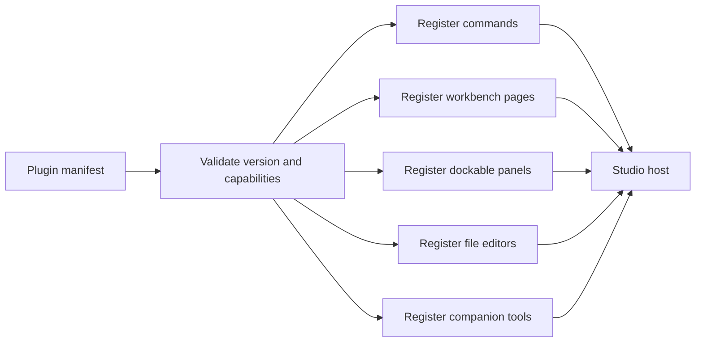
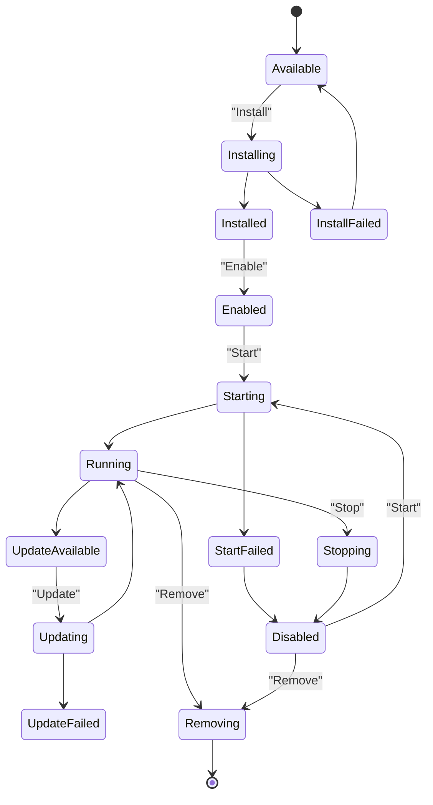
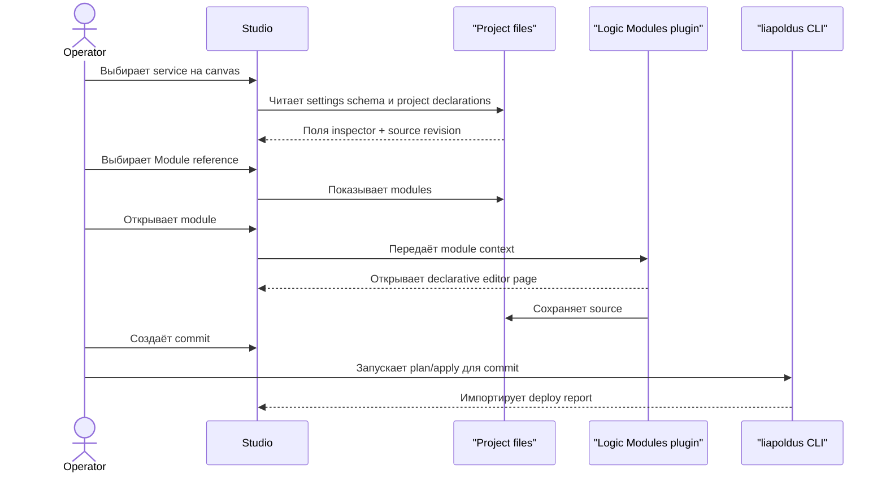

# Studio plugins и marketplace

## 1. Две разные модели

| | Core services | Studio plugins |
| --- | --- | --- |
| Назначение | Runtime/control-plane services | Расширения Studio |
| Представление | Canvas node + inspector | Commands, pages, panels |
| Lifecycle | Core наблюдает и применяет settings | Local package import/start/update |
| Settings UI | Schema-driven inspector | Собственные declarative surfaces |
| Process control | Не управляется Studio | Отдельный plugin lifecycle |
| Локальные инструменты | Не являются частью Core service | Companion console tools, принадлежащие plugin |
| Ошибка | Degraded service/replica | Plugin unavailable/disconnected |

Нельзя показывать Core service как Studio plugin marketplace item.

## 2. Extension manifest

Studio plugin должен объявлять:

- identity;
- version;
- required Studio range;
- commands;
- pages;
- panels;
- file types/editors;
- companion console tools;
- capability requirements;
- permissions explanation;
- lifecycle metadata.

Точный wire schema должен быть утверждён отдельным владельцем. В Studio этот
manifest используется для безопасной регистрации extension points.

## 3. Extension host



Studio рендерит объявленные surfaces собственными компонентами. Произвольный
HTML/CSS/remote JavaScript не должен автоматически попадать в Core inspector.
В desktop host установленный surface schema читается только через
`ReadStudioPluginSurface`: путь проверяется относительно package root,
symlink запрещены, содержимое должно быть valid JSON. Renderer получает
`surface + schema` и строит host-controlled preview из generic controls;
plugin HTML/JS в основной renderer не загружается.

## 4. Companion console tools

Companion console tool — локальный исполняемый инструмент, который поставляется
в составе Studio plugin и регистрируется в Studio под стабильным логическим
`toolId`. Это расширение developer workflow, а не Core service и не замена
standalone `liapoldus` CLI.

Например, Studio plugin для Runtime может поставлять `runtime.wasm-compiler`:
компилятор, который собирает исходник модуля в WASM и возвращает diagnostics и
build artifacts. Это companion tool Studio plugin, а не бинарник Core Runtime
plugin. Пользователь устанавливает Studio plugin один раз, после чего Studio
знает, какая версия компилятора совместима с его редактором и может запускать
её из command, page или file editor.

### Границы ответственности

| Объект | Владелец | Что делает Studio |
| --- | --- | --- |
| Studio plugin | Marketplace и publisher plugin | Регистрирует surfaces, permissions и companion tools |
| Companion console tool | Publisher plugin | Поставляет executable, metadata и supported targets |
| Tool Registry | Studio host | Проверяет, устанавливает, выбирает версию и запускает зарегистрированный tool |
| Project build/deploy | Project + standalone CLI | Использует результат tool только через commit-backed workflow |
| Core service | Core и соответствующий plugin | Работает независимо от Studio plugin host |

Tool не получает Core credentials, не становится Core service и не может сам
зарегистрировать endpoint в Core. Долгоживущий runtime или network service не
маскируется под console tool: такой компонент требует отдельного решения о
plugin process и lifecycle.

### Установка вместе с plugin

В marketplace package входят extension manifest, UI assets и описания tools. Для
каждого поддерживаемого OS/architecture package указывает отдельный immutable
artifact. Установка проходит так:

1. Studio проверяет совместимость plugin и локальной платформы.
2. Загружает выбранный tool artifact и проверяет declared SHA-256 digest;
   publisher signature проверяется, когда для текущего release channel настроен
   trust root.
3. Распаковывает его в versioned Studio-managed directory атомарно.
4. Регистрирует `toolId`, версию, executable и capabilities в Tool Registry.
5. Делает plugin доступным только после успешной проверки всех обязательных
   artifacts.

Неуспешная установка не оставляет частично активный tool. При обновлении новая
версия сначала проверяется полностью, затем становится active; текущий running
process не подменяется посреди запуска. Удаление освобождает tool только после
завершения связанных процессов и не удаляет project source или build artifacts.

### Регистрация и запуск

Tool descriptor должен как минимум содержать:

- namespaced `toolId` и human-readable name;
- tool version и supported Studio/plugin range;
- relative executable path внутри package;
- OS/architecture artifacts с digest и signature metadata;
- режимы вызова (`plugin`, `studio-command` или `terminal`);
- requested filesystem, network и environment permissions;
- тип результата: diagnostics, generated files, stdout или report.

Studio не добавляет executable в глобальный `PATH` автоматически и не принимает
произвольную строку shell-команды от plugin UI. Plugin вызывает Tool Registry по
`toolId`; Registry сам выбирает digest-проверенный executable, передаёт ограниченный
working directory и возвращает structured result. Для пользователя доступны
запуск из Studio и, при явном согласии, копирование exact command или создание
user-scoped shell alias.

В desktop implementation этот boundary реализован через `StudioPluginHost` и
`CompanionToolRunner`: package сначала проходит inspection/trust dialog,
metadata сохраняется в global SQLite, а tool запускается прямым process call из
проверенного installed path. В UI tool запускается через typed
`RunStudioPluginTool`; cwd ограничен Project, output ограничен размером,
поддерживаются cancellation/exit code и redaction text output. Renderer получает
только declarative install metadata и structured result, но не process handle или
environment. Manifest может явно перечислить имена разрешённых environment
variables; по умолчанию tool получает пустой environment, поэтому credentials и
прочие host secrets не наследуются.
Manifest-bound tool execution также имеет bounded lifetime: descriptor может
задать `timeoutMillis`, host применяет timeout с безопасным default и верхним
пределом, возвращает `timedOut` и не оставляет бесконечный child process.

Каждый запуск получает cancellation, timeout, exit code, stdout/stderr limits и
diagnostics. В UI и report отображаются `toolId`, version и digest; secret
значения из arguments, environment и output не сохраняются.

Подпись manifest использует versioned envelope
`ed25519:<key-id>:<base64-signature>` над canonical JSON manifest без поля
`signature`. Desktop получает release trust roots через
`STUDIO_PLUGIN_TRUST_ROOTS` в формате `key-id=base64-public-key`, а
`STUDIO_PLUGIN_REQUIRE_SIGNATURES=true` включает fail-closed режим для release
канала. В обычном local mode unsigned package всё ещё требует explicit trust;
наличие signature metadata без настроенного trust root не выдаётся за
cryptographic verification.

Process isolation выбирается через `STUDIO_PLUGIN_SANDBOX_MODE`: `required`
отклоняет запуск без OS adapter, `best-effort` допускает запуск только с
structured warning `sandbox.unavailable`, а `disabled` предназначен только для
тестов. macOS использует `sandbox-exec`, Linux — `bubblewrap`; на Windows и
прочих платформах `required` fail-closed до появления соответствующего native
adapter. Default desktop mode — `best-effort`, чтобы локальный workspace мог
открыться offline, но production release обязан выставлять `required`.

Manifest может объявить один optional backend process:

```json
{
  "process": {
    "executable": "bin/plugin-backend",
    "platforms": ["darwin/arm64", "linux/amd64", "windows/amd64"],
    "environment": ["PATH"],
    "timeoutMillis": 0
  }
}
```

Host запускает его только через `StartStudioPluginProcess`, хранит lifecycle
`starting/running/stopping/stopped/failed`, не наследует environment по умолчанию
и наблюдает exit/timeout в supervisor. Crash этого процесса меняет только его
plugin state и не завершает основной workspace. Executable, platform list и
environment names проверяются до install.

Если manifest объявляет `permissions`, trust dialog требует отдельного checkbox
grant для каждой capability. Granted permissions сохраняются в SQLite вместе с
package digest; отсутствие хотя бы одной capability блокирует установку, а
последующая попытка запуска tool или backend process повторно проверяет grants.
Дополнительные permissions, которых нет в manifest, отклоняются. Trust approval
не превращается в blanket-доступ для следующей версии package.

Повторный импорт той же `id@version` отклоняется без перезаписи активного
package. Новая version устанавливается в отдельный immutable directory; если
регистрация в SQLite не проходит, новый directory удаляется, а предыдущая
версия остаётся доступной для rollback. Installed page удаляет только явно
выбранную остановленную version после confirmation; running backend process
сначала требуется остановить.

Пример декларации (эскиз, не утверждённый wire schema):

```yaml
tools:
  - id: runtime.wasm-compiler
    version: 0.4.0
    executable: bin/wasm-compiler
    environment: [PATH, TMPDIR]
    invocation: [plugin, studio-command, terminal]
    artifacts:
      - platform: darwin/arm64
        path: bin/wasm-compiler
        digest: sha256:<64-hex-digits>
    permissions:
      filesystem: [project-read, build-write]
      network: false
    result: diagnostics-and-artifacts
```

Если tool влияет на deployable artifact, результат должен включать exact tool
version и digest. Это позволяет отличить «исходник тот же, но compiler другой»
от обычного повторного запуска и передать provenance в CLI/CI report. Формат
project lock и окончательная schema manifest будут отдельными versioned
контрактами; до их утверждения этот YAML нельзя считать публичным API.

## 5. Capabilities

Возможные группы доступа:

- read project metadata;
- read selected files;
- write selected project files;
- read imported CLI/CI reports;
- read project service settings schemas;
- open CLI deploy handoff or report import surface;
- register commands/pages/panels;
- install and invoke declared companion tools.

Capability видна до установки и до первого использования. Raw Core token,
private key и secret value не выдаются plugin UI или companion tool. Разрешение
на запуск tool не означает разрешение на произвольный shell, доступ ко всему
проекту или сетевой доступ.

## 6. Lifecycle plugin



Этот lifecycle не распространяется на Core services.

## 7. Installed packages page

Remote marketplace registry не входит в первую production scope. Studio работает
с локальным `.studio-plugin` через file picker; Installed page показывает
пакеты, которые уже проверены и установлены на этой машине.

### Import package

Перед install показываются:

- publisher;
- версия и release channel;
- диапазон Studio;
- заявленные capabilities;
- requested permissions;
- companion tools, platforms и requested tool permissions;
- changelog/release metadata;
- explicit trust decision и install action.

### Installed

Для каждого plugin:

- installed version;
- enabled/disabled;
- running/stopped;
- compatibility;
- granted permissions;
- installed tools с version/digest и их состоянием;
- available update;
- stop/update/remove actions.

## 8. Failure isolation

Если Studio plugin недоступен:

- project config canvas остаётся рабочим;
- plugin panels переходят в unavailable;
- project files не удаляются;
- schema-driven project inspector остаётся доступен;
- operations продолжают отображаться;
- недоступность companion tool ограничивает только связанные actions и editors;
- показывается plugin-specific diagnostic.

## 9. Logic Modules

Logic Modules — пример Studio plugin, который обслуживает modules и source files.
Он не является специальным режимом Core.

Поток:


