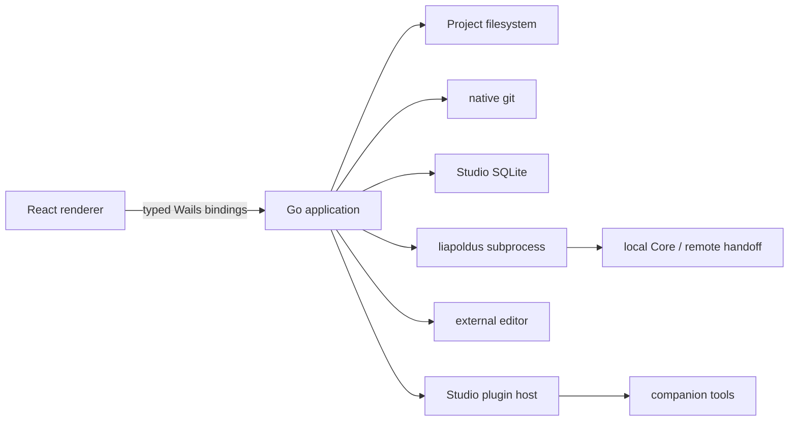

# Техническая архитектура Studio

## 1. Назначение

Studio — desktop development environment для developer-operator. Она владеет
локальным Project, файловым деревом, Git workflow, configuration canvas и
локальными расширениями Studio. Она не является Core client и не импортирует
внутренние Go packages Core или CLI.

Studio запускается только как Wails desktop application. Web distribution Studio
не поддерживается.

## 2. Runtime boundaries



Правила границы:

- React не читает filesystem и не запускает процессы напрямую;
- Studio не открывает Core SQLite и не вызывает Core Management API;
- все Core operations проходят через `liapoldus` CLI;
- local Core допускает start/stop/status/logs/plan/apply через CLI;
- remote deployment превращается в CLI handoff;
- remote handoff создаётся как revision-pinned credential-free JSON artifact и
  никогда не исполняется самим Studio;
- CLI credentials не передаются в Wails bindings или plugin surfaces;
- settings forms используют отдельный schema-aware boundary: renderer получает
  только redacted projection, а host применяет безопасный patch к canonical
  settings file; перед записью host проверяет типы, required-поля, enum,
  numeric/string/array constraints и nested objects, разрешает только
  project-relative `$ref`/JSON Pointer и проверяет `allOf`/`anyOf`/`oneOf`,
  `readOnly` и nullable types; unsupported или cyclic schema vocabulary
  завершает операцию fail-closed. Renderer получает resolved schema через
  typed `ReadProjectSchema`, а sensitive defaults/examples/const/enum не
  попадают в frontend;
- Core/runtime plugin binaries не загружаются в Studio.

## 3. Go layers

```text
internal/domain
  models/        pure Studio values and invariants
  interfaces/    ports used by application layer

internal/application
  project/       open, inspect, file tree, drafts
  versioning/    status, diff, commit, branch and conflict workflows
  workspace/     canvas graph, selection, layout and reports
  cli/           typed command/event/report orchestration
  plugins/       package, manifest, trust and surface lifecycle

internal/infrastructure
  filesystem/    path-safe project file access
  git/           native git subprocess adapter
  sqlite/        global application metadata
  projectstate/  `.studio/` project-local state
  cli/           liapoldus process adapter
  plugins/       package installer and process host
  desktop/       external editor and OS integration

internal/presentation/wails
  typed bindings, event subscriptions and desktop composition root
```

Application services depend only on domain ports. Infrastructure adapters do not
contain product policy. Wails methods are thin transport adapters and never
contain Git, filesystem, CLI or plugin business logic.

## 4. Core ports

```go
type ProjectRepository interface {
    Open(ctx context.Context, root string) (ProjectSnapshot, error)
    ReadFile(ctx context.Context, project ProjectID, path RelativePath) ([]byte, error)
    WriteFile(ctx context.Context, project ProjectID, path RelativePath, data []byte) error
    Tree(ctx context.Context, project ProjectID) ([]ProjectFile, error)
}

type FileSystem interface {
    ReadFile(ctx context.Context, root, relative string) ([]byte, error)
    WriteFile(ctx context.Context, root, relative string, data []byte) error
}

type GitRepository interface {
    Status(ctx context.Context, root string) (GitStatus, error)
    Diff(ctx context.Context, root string) (GitDiff, error)
    Commit(ctx context.Context, root string, request CommitRequest) (Revision, error)
    Branches(ctx context.Context, root string) ([]Branch, error)
}

type CliRunner interface {
    Run(ctx context.Context, request CliRequest) (<-chan CliEvent, error)
}

type PluginPackageInstaller interface {
    Inspect(ctx context.Context, packagePath string) (PackageInspection, error)
    Install(ctx context.Context, packagePath string, trust TrustDecision) (InstalledPlugin, error)
    Remove(ctx context.Context, pluginID string) error
}

type ExternalEditorLauncher interface {
    Open(ctx context.Context, root, relative, application string) error
}

type ReportStore interface {
    Save(ctx context.Context, root string, report Report, annotations []RedactionAnnotation) (string, error)
    List(ctx context.Context, root string) ([]Report, error)
}
```

Текущие инфраструктурные реализации уже включают project tree/graph reader,
project-scoped filesystem, native Git status, schema-aware settings и link
contract boundary, CLI JSONL process runner, redacted report store, local plugin
package installer, project-local `.studio/workspace.json` и external editor
launcher. Git adapter также предоставляет bounded diff, branch catalog и
confirmation-gated commit/pull/push operations. Companion tools запускаются из
verified package path с platform check, output limit, redaction и manifest
timeout. Declarative surface rendering и supervised optional plugin processes
проходят host-controlled boundary; target catalog UI остаётся отдельным
production increment. Установленные surfaces
проходят host-controlled JSON schema preview; arbitrary plugin frontend не
загружается.

Wails не принимает remote URL или credential values: remote/branch identifiers
проходят allowlist validation, а Git operations выполняются только для текущего
Project.

Публичные модели должны быть versioned и сериализуемыми. Нельзя отдавать
frontend внутренние `sql.Rows`, `exec.Cmd`, absolute secret paths или raw
credentials.

## 5. State ownership

| Состояние | Источник истины | Хранилище Studio |
| --- | --- | --- |
| Project files | рабочий Git checkout | filesystem |
| Git history | Git repository | `.git` |
| Canvas/layout/tabs | Studio project state | `.studio/` |
| Known projects/theme | Studio client | OS application SQLite; theme is `system`, `light` or `dark` |
| Installed local plugins | Studio package registry | OS application SQLite + package directory |
| External editor associations | Studio host | OS application SQLite; executable path only |
| Local Core state | Core + CLI | CLI/Core storage |
| Deploy/traffic evidence | CLI/Core report | `.studio/reports/` |
| Recoverable failures | Studio diagnostic projection | `.studio/diagnostics.jsonl` |

`.studio/` исключается из bundle. Reports сохраняются только после redaction.

## 6. Failure model

Каждый use case возвращает typed diagnostic с `code`, `severity`, `owner`,
`location` и `nextStep`. UI обязан различать `invalid`, `unavailable`, `stale`,
`permissionDenied`, `conflict`, `degraded` и `failed`.

Process failures не должны завершать Studio. CLI/plugin/tool process получает
cancel, timeout и output limit; завершение фиксируется как reportable diagnostic.
